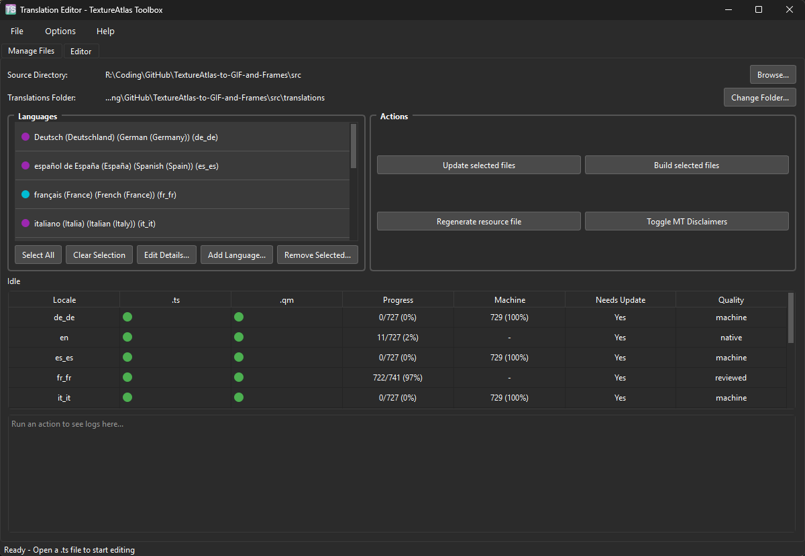
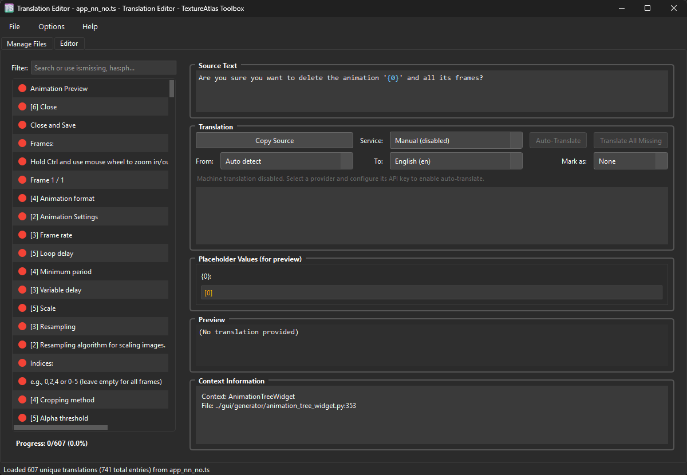
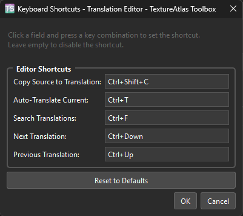
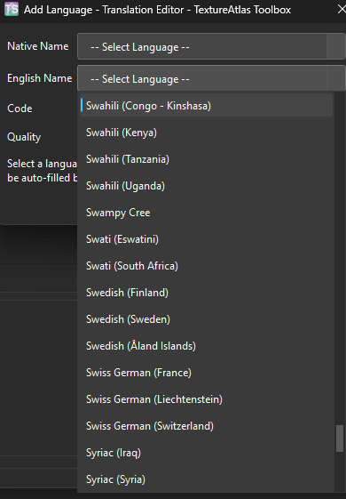
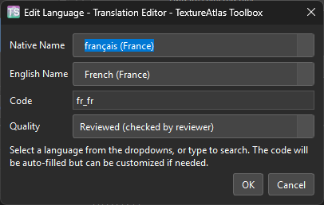
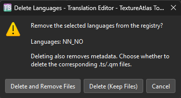

# Translation Editor

A Simple Qt-based GUI tool for editing translation files (.ts) for the TextureAtlas Toolbox.

It technically works with other PySide6 apps as well, but that's not its intended usage. Feel free to try, but no support will be provided.

## Table of Contents

- [Project File Structure](#project-file-structure)
- [Features](#features)
- [Usage](#usage)
- [Translation API Setup](#translation-api-setup)
- [Command-Line Interface](#command-line-interface)
- [Screenshots](#screenshots)

## Project File Structure

```
translator-app/
├── src/
│   ├── Main.py              # Main application entry point
│   ├── cli.py               # Command-line interface
│   ├── core/                # Core translation logic
│   ├── gui/                 # UI components
│   ├── localization/        # Language registry and operations
│   ├── providers/           # Translation service providers
│   └── utils/               # Utilities and preferences
├── setup/
│   ├── build_portable.py    # Portable build script
│   ├── build-portable-windows.bat
│   └── build-portable-unix.sh
├── templates/               # Translation file templates
└── README.md
```

## Features

- **Smart String Grouping**: Automatically groups identical source strings across multiple contexts, reducing translation work
- **Syntax Highlighting**: Highlights placeholders (e.g., `{count}`, `{filename}`) in both source and translation text
- **Dark/Light Mode**: Toggle between themes for comfortable editing in any environment
- **Real-time Preview**: See how translations look with actual placeholder values
- **Validation System**: Prevents saving files with missing or extra placeholders
- **Context Information**: Shows all contexts where each string is used
- **Copy Source**: Quick button to copy source text as a starting point for translation
- **Translation Services Integration**: Supports Google Cloud, DeepL and LibreTranslate services
- **Language Management**: Register languages, set quality levels, and manage MT disclaimers
- **CLI Support**: Batch operations for CI/CD integration

## Usage

### Running the Application

**Option 1: Portable build with embedded Python (Recommended)**

Uses a self-contained Python environment - no system Python installation required.

*Windows:*
Run the `Translation Editor.bat` file


*Linux/macOS:*
Run the `translation-editor.sh` file by double clicking it (double check execution permission)


**Option 2: Running directly with Python, works with the embeddable source too**

```bash
cd src
python Main.py
```

**Option 3: Command-line interface (CLI)**

For batch operations and CI/CD integration, use the CLI directly:

```bash
# Run CLI through Main.py
python src/Main.py --cli <command> [options]

# Or run cli.py directly
python src/cli.py <command> [options]

# Examples
python src/cli.py status           # Show translation progress
python src/cli.py extract fr de    # Extract strings for French and German
python src/cli.py compile --all    # Compile all translations
```

See [Command-Line Interface](#command-line-interface) section below for full details.

### Quick Start (GUI)

1. **Run the app**
2. **Select existing language or add a new one**
3. **Add translation**
4. **Save**: Use Ctrl+S or click "Save .ts File"

### Visual Indicators (GUI)

- Green: Translation is complete
- Purple: Machine translation
- Yellow: Unsure
- Red: Translation is missing
- Number badge: String appears in multiple contexts (grouped)

### Keyboard Shortcuts (GUI)

- `Ctrl+O`: Open file
- `Ctrl+S`: Save file
- `Ctrl+Shift+S`: Save as
- `Ctrl+Q`: Exit
- `Ctrl+Shift+C`: Copy source text
- `Ctrl+T`: Auto-translate current
- `Ctrl+F`: Search translations
- `Ctrl+Down`: Next translation
- `Ctrl+Up`: Previous translation

## Command-Line Interface

The Translation Editor includes a CLI for batch operations and CI/CD integration.

### CLI Usage

```bash
# Run CLI through Main.py
python Main.py --cli <command> [options]

# Or run cli.py directly
python cli.py <command> [options]

# Get help
python cli.py help
python cli.py help <command>
```

### Available Commands

| Command | Description |
|---------|-------------|
| `extract` | Run lupdate to extract translatable strings from source |
| `compile` | Run lrelease to compile .ts files to .qm binaries |
| `resource` | Generate translations.qrc file |
| `status` | Show translation progress report |
| `disclaimer` | Add, remove, or toggle MT disclaimers |
| `quality` | Set translation quality level (machine/reviewed/unknown) |
| `help` | Show help for a command |

### CLI Examples

```bash
# Extract strings for specific languages
python cli.py extract fr_FR de_DE

# Compile all languages
python cli.py compile

# Show translation status
python cli.py status

# Add disclaimer to French translation
python cli.py disclaimer --add fr_FR

# Remove disclaimer
python cli.py disclaimer --remove fr_FR

# Toggle disclaimer (add if missing, remove if present)
python cli.py disclaimer --toggle fr_FR

# Set quality level
python cli.py quality fr_FR --set reviewed
python cli.py quality de_DE es_ES --set machine

# Specify custom source directory
python cli.py --src-dir /path/to/project/src status
```

## Optional Machine Translation API Setup

Machine translation is optional. Configure API keys via environment variables to enable auto-translate features.

### DeepL

DeepL offers high-quality translations with both free (500k chars/month) and paid Pro plans.

1. Sign up at [deepl.com/pro](https://www.deepl.com/pro) and get an API key
2. Set the environment variable:

```bash
# Linux/macOS
export DEEPL_API_KEY="your-api-key-here"

# Windows (Command Prompt)
set DEEPL_API_KEY=your-api-key-here

# Windows (PowerShell)
$env:DEEPL_API_KEY = "your-api-key-here"
```

**Optional variables:**
- `DEEPL_API_ENDPOINT` — Custom endpoint URL (default: `https://api-free.deepl.com/v2/translate`). Set to `https://api.deepl.com/v2/translate` for Pro accounts.
- `DEEPL_TARGET_EN_VARIANT` — English variant for target (`EN-US` or `EN-GB`, default: `EN-US`)
- `DEEPL_TARGET_PT_VARIANT` — Portuguese variant for target (`PT-BR` or `PT-PT`, default: `PT-BR`)

### Google Cloud Translation

Google Cloud Translation uses the Basic (v2) API and bills per character.

1. Create a project in [Google Cloud Console](https://console.cloud.google.com/)
2. Enable the **Cloud Translation API**
3. Create an API key under **APIs & Services > Credentials**
4. Set the environment variable:

```bash
# Linux/macOS
export GOOGLE_TRANSLATE_API_KEY="your-api-key-here"

# Windows (Command Prompt)
set GOOGLE_TRANSLATE_API_KEY=your-api-key-here

# Windows (PowerShell)
$env:GOOGLE_TRANSLATE_API_KEY = "your-api-key-here"
```

### LibreTranslate (Self-Hosted)

[LibreTranslate](https://github.com/LibreTranslate/LibreTranslate) is a free, open-source translation API you can self-host.

1. Run LibreTranslate locally via Docker or install it directly:
   ```bash
   docker run -p 5000:5000 libretranslate/libretranslate
   ```
2. Set the environment variable:

```bash
# Linux/macOS
export LIBRETRANSLATE_ENDPOINT="http://127.0.0.1:5000/translate"

# Windows (Command Prompt)
set LIBRETRANSLATE_ENDPOINT=http://127.0.0.1:5000/translate

# Windows (PowerShell)
$env:LIBRETRANSLATE_ENDPOINT = "http://127.0.0.1:5000/translate"
```

**Optional:** If your instance requires authentication, also set `LIBRETRANSLATE_API_KEY`.

### Persistent Configuration

**Option 1: Environment Variables**

- **Windows:** Add them via System Properties > Environment Variables
- **Linux/macOS:** Add `export` lines to `~/.bashrc`, `~/.zshrc`, or `~/.profile`

**Option 2: Preferences File**

You can also store API keys in the app's preferences file located at:

```
~/.textureatlastoolbox_translator.json
```

Add your keys to the JSON file:

```json
{
  "deepl_api_key": "your-deepl-key",
  "google_translate_api_key": "your-google-key",
  "libretranslate_endpoint": "http://127.0.0.1:5000/translate",
  "libretranslate_api_key": "your-libretranslate-key"
}
```

> ⚠️ **INFORMATION:** This file is stored locally on your machine. **Never share this file or your API keys with anyone.** The application only uses these keys to authenticate directly with the translation service you choose—it never sends them to any third-party servers.

## Screenshots

#### Quick Workflow with Machine Translation showcase


#### Translation File Manager


#### Translation Editor Tab


#### Keyboard Shortcuts Settings



#### Add Language Window


#### Edit Language Window


#### Delete Language Window

